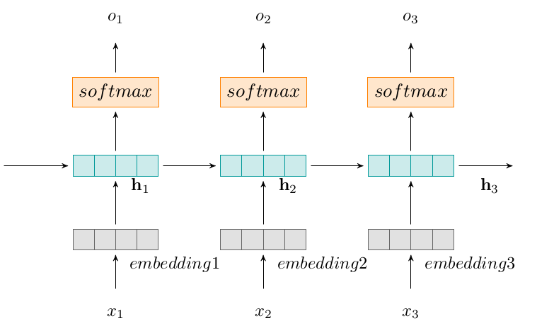

# Recurrent Neural Network Models for Error Correction

This repository provides the source code of various models that have been described in [my master's thesis](http://sinaahmadi.github.io/files/[SinaAhmadi]Masters_thesis.pdf). This project aims at implementing and evaluating neural network models, in particular, Recurrent Neural Network (RNN), Bidirectional Neural Network (BRNN), Sequence-to-Sequence (seq-to-seq) models and finally, attention-based Sequence-to-Sequence models. Regarding the confidentiality of the project, some parts of the codes may not have been provided in their entirety. 

In the implementation of the current project we have been using DyNet. The *Dynamic Neural Network Toolkit*, or DyNet, is a neural network library suited to networks that have dynamic structures.  DyNet supports both static and dynamic declaration strategies used in neural networks computations.  In the dynamic declaration, each network is built by using a directed and acyclic computation graph that is composed of expressions and parameters that define the model. Working efficiently on CPU or GPU, DyNet has powered a number of NLP research papers and projects recently. You may find more information about DyNet [here](http://dynet.readthedocs.io/en/latest/index.html#). 

Our approach is language-independent. Specifically for our project, we have trained and evaluated the models using the QALB corpus which is an Arabic corpus annotated based on the annotation style of the CoNLL-2013 shared task. The `preprocessing` class may help you in extracting specific parts of the annotated corpus into trainable data sets.

Assuming the task of grammatical and spelling error correction as a monolingual translation task, each model is trained using a potentially incorrect with its gold-standard correciton as training instance. The following figure illustrated a Recurrent Neural Network for the task of error correction: 

